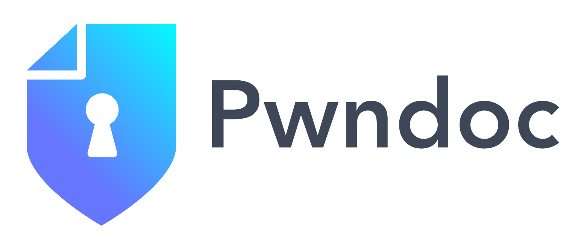

# PwnDoc

<div align="center">



**一个现代化的渗透测试报告应用程序，具有AI驱动的翻译功能**

[](LICENSE)
[](DOCKER_DEPLOYMENT.md)
[](#-ai翻译功能)

[](README.md)

</div>

---

## 📋 目录

- [概述](#-概述)
- [主要功能](#-主要功能)
- [快速开始](#-快速开始)
  - [Docker 部署 (推荐)](#docker-部署-推荐)
  - [手动安装](#手动安装)
- [AI 翻译功能](#-ai翻译功能)
- [演示](#-演示)
- [文档](#-文档)
- [架构](#-架构)
- [贡献](#-贡献)
- [许可证](#-许可证)

---

## 🎯 概述

PwnDoc 是一个全面的渗透测试报告应用程序，旨在使安全审计文档变得简单、高效和协作。主要目标是通过在用户之间共享漏洞数据，让我们有更多时间去 **Pwn**，更少时间去 **Doc**。

### PwnDoc 的独特之处

- **🤖 AI 驱动翻译**: 一键智能翻译中文安全审计报告为英文
- **🔧 高度可定制**: 自定义模板、字段和部分
- **👥 多用户协作**: 实时协作编辑
- **📄 专业报告**: 生成可定制的 Docx 报告
- **🌐 多语言支持**: 界面支持多种语言
- **🐳 Docker 就绪**: 完整的容器化部署解决方案

---

## ✨ 主要功能

### 核心功能
- **多用户报告**: 协作式审计创建和编辑
- **漏洞管理**: 集中式漏洞数据库和可重用发现
- **自定义模板**: 灵活的 Docx 模板系统，用于品牌化报告
- **数据管理**: 审计数据的导入/导出功能
- **基于角色的访问**: 细粒度的权限和用户管理

### AI 增强功能 🤖
- **智能翻译**: 自动中英文翻译，保留 HTML 格式
- **智能字段补全**: AI 辅助生成漏洞描述和修复建议
- **专业术语**: 网络安全专业术语翻译准确性
- **多 LLM 支持**: OpenAI、Azure OpenAI 和本地 Ollama 集成
- **内容保护**: 创建新审计而不修改原始内容

### 技术功能
- **现代架构**: Vue.js 前端与 Node.js 后端
- **数据库**: MongoDB 用于灵活的数据存储
- **API 优先设计**: 具有全面文档的 RESTful API
- **Docker 支持**: 使用 docker-compose 的完整容器化
- **安全性**: JWT 认证和基于角色的授权

---

## 🚀 快速开始

### Docker 部署 (推荐)

使用 Docker 运行 PwnDoc 的最快方法:

```bash
# 克隆仓库
git clone https://github.com/pwndoc/pwndoc.git
cd pwndoc

# 使用自动化脚本启动
chmod +x docker-start.sh
./docker-start.sh

# 或者手动使用 docker-compose
docker-compose up --build -d
```

**访问点:**
- **前端**: https://localhost:8443
- **后端 API**: http://localhost:4242
- **数据库**: localhost:27017

有关详细的 Docker 部署说明，请参见 [DOCKER_DEPLOYMENT.md](DOCKER_DEPLOYMENT.md)。

### 手动安装

<details>
<summary>点击展开手动安装步骤</summary>

#### 先决条件
- Node.js (推荐 v14+)
- MongoDB (v4.2+)
- npm 或 yarn

#### 后端设置
```bash
cd backend
npm install
cp .env.example .env
# 配置您的 .env 文件
npm start
```

#### 前端设置
```bash
cd frontend
npm install
npm run dev
```

#### 数据库设置
```bash
# 启动 MongoDB
mongod

# 应用程序将自动创建必要的集合
```

</details>

---

## 🤖 AI 翻译功能

此增强版本的 PwnDoc 包含强大的 AI 驱动翻译功能，简化了创建多语言安全审计报告的流程。

### 主要功能：
- **一键翻译**：单击按钮即可翻译整个审计报告
- **智能内容处理**：自动将中文翻译为英文，同时保留 HTML 标签和格式
- **专业术语**：使用网络安全专业术语确保技术翻译的准确性
- **新建审计**：创建新的英文审计而不是修改原始内容，保护您的源内容
- **多 LLM 支持**：兼容 OpenAI、Azure OpenAI 和本地 Ollama 模型

### 使用方法：
1. 导航到审计列表页面
2. 点击任意审计旁边的"Translate to English"按钮
3. 系统将创建一个带有"(English Translation)"后缀的新审计
4. 所有发现（标题、描述、观察、修复建议、POC）将自动翻译
5. 您将被重定向到新的翻译审计

### 配置：
在设置页面配置您的 AI 服务：
- **提供商**：选择 OpenAI、Azure 或自定义（Ollama）
- **模型**：选择您偏好的模型（如 gpt-4、llama3.1:8b）
- **API 设置**：配置端点和身份验证

---

## 🎬 演示

### 多用户报告


### 发现编辑


### 漏洞管理工作流程


### 新增演示内容

#### AI 自动翻译演示


#### 应用界面截图


#### 功能演示截图
.png)

---

## 📚 文档

### 用户指南
- [安装指南](https://pwndoc.github.io/pwndoc/#/installation)
- [数据管理](https://pwndoc.github.io/pwndoc/#/data)
- [漏洞管理](https://pwndoc.github.io/pwndoc/#/vulnerabilities)
- [审计创建](https://pwndoc.github.io/pwndoc/#/audits)
- [模板定制](https://pwndoc.github.io/pwndoc/#/docxtemplate)

### 技术文档
- [Docker 部署指南](DOCKER_DEPLOYMENT.md)
- [API 文档](docs/api/)
- [开发设置](backend/README.md)
- [安全指南](SECURITY.md)

---

## 🏗️ 架构

PwnDoc 遵循现代三层架构:

```
┌─────────────────┐    ┌─────────────────┐    ┌─────────────────┐
│   前端          │    │    后端         │    │    数据库       │
│                 │    │                 │    │                 │
│  Vue.js         │◄──►│  Node.js        │◄──►│  MongoDB        │
│  Quasar         │    │  Express.js     │    │                 │
│  Nginx (Docker) │    │  JWT Auth       │    │  GridFS         │
└─────────────────┘    └─────────────────┘    └─────────────────┘
                              │
                              ▼
                    ┌─────────────────┐
                    │   AI 服务       │
                    │                 │
                    │  OpenAI API     │
                    │  Azure OpenAI   │
                    │  本地 Ollama    │
                    └─────────────────┘
```

### 技术栈
- **前端**: Vue.js 2, Quasar Framework, Axios
- **后端**: Node.js, Express.js, Mongoose ODM
- **数据库**: 带 GridFS 的 MongoDB 用于文件存储
- **认证**: 带基于角色访问的 JWT 令牌
- **AI 集成**: OpenAI, Azure OpenAI, Ollama 支持
- **部署**: Docker, docker-compose, Nginx

---

## 🤝 贡献

我们欢迎贡献！请参阅我们的贡献指南:

1. Fork 仓库
2. 创建功能分支 (`git checkout -b feature/amazing-feature`)
3. 提交您的更改 (`git commit -m 'Add amazing feature'`)
4. 推送到分支 (`git push origin feature/amazing-feature`)
5. 打开 Pull Request

### 开发设置

```bash
# 克隆仓库
git clone https://github.com/pwndoc/pwndoc.git
cd pwndoc

# 安装依赖
cd backend && npm install
cd ../frontend && npm install

# 启动开发服务器
npm run dev  # 后端
npm run serve  # 前端
```

---

## 📄 许可证

该项目根据 MIT 许可证授权 - 有关详细信息，请参见 [LICENSE](LICENSE) 文件。

---

## 🙏 致谢

- 原始 PwnDoc 团队奠定基础
- OpenAI 提供 AI 翻译功能
- Vue.js 和 Quasar 社区
- 所有贡献者和用户

---

<div align="center">

**用 ❤️ 为网络安全社区而制作**

[⭐ Star this repo](https://github.com/pwndoc/pwndoc) | [🐛 报告 Bug](https://github.com/pwndoc/pwndoc/issues) | [💡 请求功能](https://github.com/pwndoc/pwndoc/issues)

[English Version](README.md)

</div>