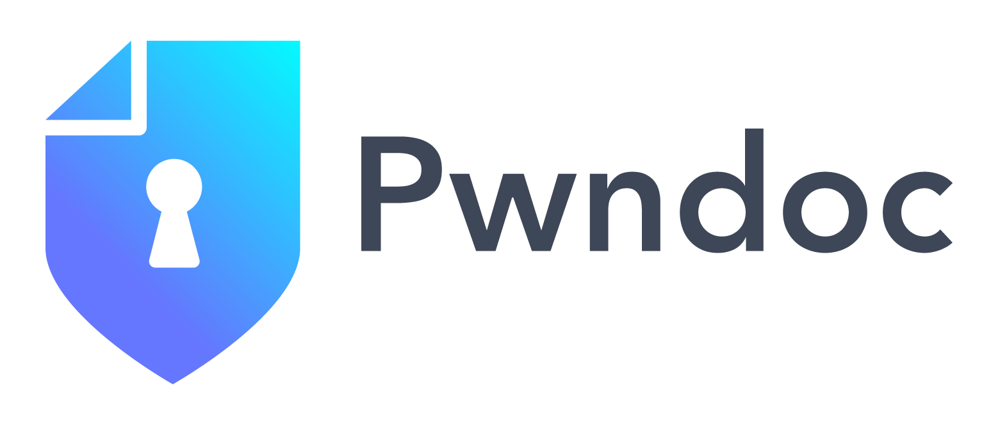

# PwnDoc

<div align="center">



**A modern pentest reporting application with AI-powered translation capabilities**

[](LICENSE)
[](DOCKER_DEPLOYMENT.md)
[](#-ai-translation-feature)

[](README-zh.md)

</div>

---

## 📋 Table of Contents

- [Overview](#-overview)
- [Key Features](#-key-features)
- [Quick Start](#-quick-start)
  - [Docker Deployment (Recommended)](#docker-deployment-recommended)
  - [Manual Installation](#manual-installation)
- [AI Translation Feature](#-ai-translation-feature)
- [Demos](#-demos)
- [Documentation](#-documentation)
- [Architecture](#-architecture)
- [Contributing](#-contributing)
- [License](#-license)

---

## 🎯 Overview

PwnDoc is a comprehensive pentest reporting application designed to make security audit documentation simple, efficient, and collaborative. The main goal is to have more time to **Pwn** and less time to **Doc** by mutualizing data like vulnerabilities between users.

### What Makes PwnDoc Special?

- **🤖 AI-Powered Translation**: One-click intelligent translation of Chinese security audit reports to English
- **🔧 Highly Customizable**: Custom templates, fields, and sections
- **👥 Multi-User Collaboration**: Real-time collaborative editing
- **📄 Professional Reports**: Generate customizable Docx reports
- **🌐 Multilingual Support**: Interface available in multiple languages
- **🐳 Docker Ready**: Complete containerized deployment solution

---

## ✨ Key Features

### Core Functionality
- **Multi-User Reporting**: Collaborative audit creation and editing
- **Vulnerability Management**: Centralized vulnerability database with reusable findings
- **Custom Templates**: Flexible Docx template system for branded reports
- **Data Management**: Import/export capabilities for audit data
- **Role-Based Access**: Granular permissions and user management

### AI-Enhanced Features 🤖
- **Intelligent Translation**: Automatic Chinese-to-English translation preserving HTML formatting
- **Smart Field Completion**: AI-assisted generation of vulnerability descriptions and remediation
- **Professional Terminology**: Cybersecurity-specific translation accuracy
- **Multiple LLM Support**: OpenAI, Azure OpenAI, and local Ollama integration
- **Content Preservation**: Creates new audits without modifying originals

### Technical Features
- **Modern Architecture**: Vue.js frontend with Node.js backend
- **Database**: MongoDB for flexible data storage
- **API-First Design**: RESTful API with comprehensive documentation
- **Docker Support**: Complete containerization with docker-compose
- **Security**: JWT authentication and role-based authorization

---

## 🚀 Quick Start

### Docker Deployment (Recommended)

The fastest way to get PwnDoc running is using Docker:

```bash
# Clone the repository
git clone https://github.com/pwndoc/pwndoc.git
cd pwndoc

# Start with the automated script
chmod +x docker-start.sh
./docker-start.sh

# Or manually with docker-compose
docker-compose up --build -d
```

**Access Points:**
- **Frontend**: https://localhost:8443
- **Backend API**: http://localhost:4242
- **Database**: localhost:27017

For detailed Docker deployment instructions, see [DOCKER_DEPLOYMENT.md](DOCKER_DEPLOYMENT.md).

### Manual Installation

<details>
<summary>Click to expand manual installation steps</summary>

#### Prerequisites
- Node.js (v14+ recommended)
- MongoDB (v4.2+)
- npm or yarn

#### Backend Setup
```bash
cd backend
npm install
cp .env.example .env
# Configure your .env file
npm start
```

#### Frontend Setup
```bash
cd frontend
npm install
npm run dev
```

#### Database Setup
```bash
# Start MongoDB
mongod

# The application will create necessary collections automatically
```

</details>

---

## 🤖 AI Translation Feature

### English

This enhanced version of PwnDoc includes powerful AI-driven translation capabilities that streamline the process of creating multilingual security audit reports.

#### Key Capabilities:
- **One-Click Translation**: Translate entire audit reports with a single button click
- **Smart Content Processing**: Automatically translates Chinese text to English while preserving HTML tags and formatting
- **Professional Terminology**: Uses cybersecurity-specific terminology for accurate technical translations
- **New Audit Creation**: Creates a new English audit instead of modifying the original, preserving your source content
- **Multiple LLM Support**: Compatible with OpenAI, Azure OpenAI, and local Ollama models

#### Usage:
1. Navigate to the Audits list page
2. Click the "Translate to English" button next to any audit
3. The system will create a new audit with "(English Translation)" suffix
4. All findings (title, description, observation, remediation, POC) will be automatically translated
5. You'll be redirected to the new translated audit

#### Configuration:
Configure your AI service in the Settings page:
- **Provider**: Choose between OpenAI, Azure, or Custom (Ollama)
- **Model**: Select your preferred model (e.g., gpt-4, llama3.1:8b)
- **API Settings**: Configure endpoint and authentication

---

### 中文

此增强版本的 PwnDoc 包含强大的 AI 驱动翻译功能，简化了创建多语言安全审计报告的流程。

#### 主要功能：
- **一键翻译**：单击按钮即可翻译整个审计报告
- **智能内容处理**：自动将中文翻译为英文，同时保留 HTML 标签和格式
- **专业术语**：使用网络安全专业术语确保技术翻译的准确性
- **新建审计**：创建新的英文审计而不是修改原始内容，保护您的源内容
- **多 LLM 支持**：兼容 OpenAI、Azure OpenAI 和本地 Ollama 模型

#### 使用方法：
1. 导航到审计列表页面
2. 点击任意审计旁边的"Translate to English"按钮
3. 系统将创建一个带有"(English Translation)"后缀的新审计
4. 所有发现（标题、描述、观察、修复建议、POC）将自动翻译
5. 您将被重定向到新的翻译审计

#### 配置：
在设置页面配置您的 AI 服务：
- **提供商**：选择 OpenAI、Azure 或自定义（Ollama）
- **模型**：选择您偏好的模型（如 gpt-4、llama3.1:8b）
- **API 设置**：配置端点和身份验证

---

## 🎬 Demos

### Multi-User Reporting


### Finding Edition


### Vulnerability Management Workflow


### Additional Demo Content

#### AI Auto Translation Demo


#### Application Interface Screenshot


#### Feature Demo Screenshot
.png)

---

## 📚 Documentation

### User Guides
- [Installation Guide](https://pwndoc.github.io/pwndoc/#/installation)
- [Data Management](https://pwndoc.github.io/pwndoc/#/data)
- [Vulnerability Management](https://pwndoc.github.io/pwndoc/#/vulnerabilities)
- [Audit Creation](https://pwndoc.github.io/pwndoc/#/audits)
- [Template Customization](https://pwndoc.github.io/pwndoc/#/docxtemplate)

### Technical Documentation
- [Docker Deployment Guide](DOCKER_DEPLOYMENT.md)
- [API Documentation](docs/api/)
- [Development Setup](backend/README.md)
- [Security Guidelines](SECURITY.md)

---

## 🏗️ Architecture

PwnDoc follows a modern three-tier architecture:

```
┌─────────────────┐    ┌─────────────────┐    ┌─────────────────┐
│   Frontend      │    │    Backend      │    │    Database     │
│                 │    │                 │    │                 │
│  Vue.js         │◄──►│  Node.js        │◄──►│  MongoDB        │
│  Quasar         │    │  Express.js     │    │                 │
│  Nginx (Docker) │    │  JWT Auth       │    │  GridFS         │
└─────────────────┘    └─────────────────┘    └─────────────────┘
                              │
                              ▼
                    ┌─────────────────┐
                    │   AI Services   │
                    │                 │
                    │  OpenAI API     │
                    │  Azure OpenAI   │
                    │  Local Ollama   │
                    └─────────────────┘
```

### Technology Stack
- **Frontend**: Vue.js 2, Quasar Framework, Axios
- **Backend**: Node.js, Express.js, Mongoose ODM
- **Database**: MongoDB with GridFS for file storage
- **Authentication**: JWT tokens with role-based access
- **AI Integration**: OpenAI, Azure OpenAI, Ollama support
- **Deployment**: Docker, docker-compose, Nginx

---

## 🤝 Contributing

We welcome contributions! Please see our contributing guidelines:

1. Fork the repository
2. Create a feature branch (`git checkout -b feature/amazing-feature`)
3. Commit your changes (`git commit -m 'Add amazing feature'`)
4. Push to the branch (`git push origin feature/amazing-feature`)
5. Open a Pull Request

### Development Setup

```bash
# Clone the repository
git clone https://github.com/pwndoc/pwndoc.git
cd pwndoc

# Install dependencies
cd backend && npm install
cd ../frontend && npm install

# Start development servers
npm run dev  # Backend
npm run serve  # Frontend
```

---

## 📄 License

This project is licensed under the MIT License - see the [LICENSE](LICENSE) file for details.

---

## 🙏 Acknowledgments

- Original PwnDoc team for the foundation
- OpenAI for AI translation capabilities
- Vue.js and Quasar communities
- All contributors and users

---

<div align="center">

**Made with ❤️ for the cybersecurity community**

[⭐ Star this repo](https://github.com/pwndoc/pwndoc) | [🐛 Report Bug](https://github.com/pwndoc/pwndoc/issues) | [💡 Request Feature](https://github.com/pwndoc/pwndoc/issues)

</div>
